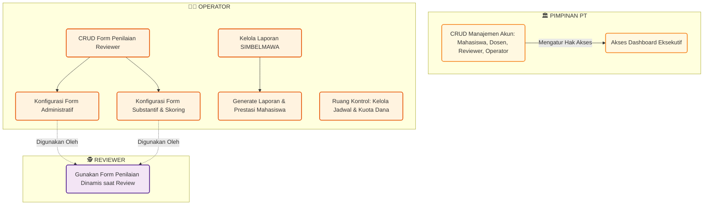

# 📊 Activity Diagram Sistem Pengajuan Proposal PKM

Dokumen ini memuat _Activity Diagram_ yang memetakan seluruh entitas pengguna di dalam sistem. Selain alur pengajuan proposal, diagram ini juga mencakup fitur-fitur manajemen sistem seperti pengelolaan akun, konfigurasi form penilaian, dan pembuatan laporan.

---

## 1. Diagram Alur Utama (Pengajuan & Penilaian Proposal)

Diagram ini menunjukkan alur hidup sebuah proposal dari saat diajukan oleh mahasiswa hingga ditetapkan pendanaannya oleh pimpinan perguruan tinggi.

```mermaid
flowchart TD
    %% Styling
    classDef mhs fill:#e1f5fe,stroke:#01579b,stroke-width:2px;
    classDef dsn fill:#f1f8e9,stroke:#33691e,stroke-width:2px;
    classDef opr fill:#fff3e0,stroke:#e65100,stroke-width:2px;
    classDef rev fill:#f3e5f5,stroke:#4a148c,stroke-width:2px;
    classDef univ fill:#ffebee,stroke:#b71c1c,stroke-width:2px;
    classDef pim fill:#fff8e1,stroke:#f57f17,stroke-width:2px;
    classDef startend fill:#333,stroke:#333,color:#fff,stroke-width:2px,rx:20px,ry:20px;

    Mulai([Mulai]):::startend
    Selesai([Selesai]):::startend

    %% Swimlane Mahasiswa
    subgraph Mahasiswa [👩‍🎓 MAHASISWA]
        M1(Login System):::mhs
        M2(Isi Form & Upload Proposal):::mhs
        M3(Terima Catatan & Upload Revisi Biasa):::mhs
        M4(Upload Revisi Akhir):::mhs
        M5(Pantau Status di Dashboard):::mhs
    end

    %% Swimlane Dosen Pendamping
    subgraph Dosen [👨‍🏫 DOSEN PENDAMPING]
        D1(Validasi 1: Review Proposal Awal):::dsn
        D2(Validasi 2: Review Hasil Revisi):::dsn
        D3(Pantau Hasil Review & Final Mahasiswa Bimbingan):::dsn
    end

    %% Swimlane Operator
    subgraph Operator [👨‍💻 OPERATOR]
        O0(Buka Ruang Kontrol & Jadwal):::opr
        O1(Assign Reviewer Admin & Substantif 1):::opr
        O2(Assign Reviewer Seleksi):::opr
        O3(Input Hasil Semi Final Universitas):::opr
    end

    %% Swimlane Reviewer
    subgraph Reviewer [🕵️ REVIEWER]
        R1(Review Administratif - Dinamis per Skim):::rev
        R2(Review Substantif Pertama - Catatan Saja):::rev
        R3(Review Substantif Seleksi - Skoring & Catatan):::rev
    end

    %% Swimlane Dosen Universitas
    subgraph DosenUniv [🏫 DOSEN UNIVERSITAS]
        DU1(Validasi Akhir Proposal):::univ
    end

    %% Swimlane Pimpinan PT
    subgraph PimpinanPT [🏛️ PIMPINAN PT]
        P1(Input Penilaian Final & Keputusan Pendanaan):::pim
    end

    %% Flow logic
    Mulai --> O0
    O0 --> M1
    M1 --> M2
    M2 -.-> M5
    
    M2 -->|Status: submitted| D1
    D1 -->|Ditolak| M2
    D1 -->|Disetujui (Valid)| O1
    
    O1 -->|Status: review_administratif| R1
    R1 -->|Selesai & Catatan| R2
    R2 -->|Status: revisi| M3
    M3 -.-> M5
    
    M3 -->|Status: revisi| D2
    D2 -->|Ditolak| M3
    D2 -->|Disetujui (Valid 2)| O2
    
    O2 -->|Status: review_substantif_seleksi| R3
    R3 -->|Skor & Catatan Tersimpan| O3
    
    O3 -->|Tidak Lolos| M5
    O3 -->|Lolos Semi Final| M4
    
    M4 -->|Status: validasi_akhir_dosen_univ| DU1
    DU1 -->|Ditolak| M4
    DU1 -->|Disetujui| P1
    
    P1 -->|Status: Final| M5
    P1 -.-> D3
    M5 --> Selesai
```

---

## 2. Diagram Aktivitas Manajemen Sistem & Pendukung

Selain alur proposal di atas, sistem juga memfasilitasi konfigurasi dan pelaporan yang dijalankan secara paralel (Support Processes).



---

## 📝 Penjelasan Detail Aktivitas & Fitur Sistem

### 1. Mahasiswa (`👩‍🎓 Mahasiswa`)
- **Dashboard & Pantau Proposal**: Mahasiswa memiliki akses _real-time_ untuk melihat sudah sampai mana status proposal mereka diproses (apakah sedang di-review, ditolak pembimbing, atau diminta revisi).
- **Ajukan Proposal**: Mengisi form pengajuan, mendaftarkan anggota tim, memilih skim, dan mengunggah dokumen proposal (PDF).
- **Revisi (Biasa & Akhir)**: Fitur wajib untuk mengunggah perbaikan dokumen jika terdapat catatan atau teguran pada tahap seleksi.

### 2. Dosen Pendamping (`👨‍🏫 Dosen`)
- **Dashboard Dosen Pembimbing / Pendamping**: Menampilkan rangkuman anak bimbingannya.
- **Validasi (Tahap 1 & Tahap 2)**: Filter awal dan filter kedua (setelah revisi) agar proposal yang cacat tidak masuk ke meja reviewer.
- **Melihat Hasil Review & Final**: Memantau skor dan keputusan PT (Lolos PIMNAS/Dana) dari proposal yang mereka bimbing.

### 3. Operator (`👨‍💻 Operator`)
- **Manajemen Form Penilaian (CRUD)**: _(Fitur Baru)_ Operator berkuasa untuk membuat, mengubah, menghapus kriteria penilaian beserta bobotnya (Form Substantif) dan juga checklist administrasi (Form Administratif). Form ini terhubung langsung secara dinamis dengan apa yang dilihat Reviewer saat mengulas proposal.
- **Manajemen Laporan SIMBELMAWA**: Operator dapat merekap hasil pendanaan dan prestasi untuk keperluan sinkronisasi atau pelaporan eksternal ke sistem SIMBELMAWA Kemdikbud.
- **Ruang Kontrol**: Mengontrol gerbang sistem (kapan mahasiswa boleh upload, kapan jadwal review dimulai, serta pengaturan batas dana *budget* yang dapat diminta).
- **Assignment Reviewer**: Memplot reviewer ke setiap proposal secara spesifik untuk tahap administratif, substantif, maupun seleksi skor.

### 4. Reviewer (`🕵️ Reviewer`)
- **Review Administratif**: Menguji kepatuhan format proposal menggunakan form dinamis yang sebelumnya sudah di-*setup* oleh Operator.
- **Review Substantif Tahap 1**: Memberikan *feedback* tekstual untuk mematangkan konsep mahasiswa.
- **Review Substantif Seleksi**: Memberikan skoring pada proposal (misal 1-10 per kriteria) menggunakan form terbobot yang dikonfigurasi Operator.

### 5. Dosen Universitas (`🏫 Dosen Universitas`)
- **Validasi Akhir**: Fitur filter keamanan tahap akhir sebelum pimpinan PT menetapkan dana pencairan (apakah proposal sudah sempurna sesuai teguran universitas).

### 6. Pimpinan Perguruan Tinggi (`🏛️ Pimpinan PT`)
- **Manajemen Akun**: Memiliki hak super-admin untuk melihat dan memodifikasi *users* (menambah akun reviewer, operator, menonaktifkan dosen, dll).
- **Penetapan Hasil Final**: Berwenang absolut untuk menilai "Lolos PIMNAS" dan men-set nominal "Dana Cair" berdasarkan rekomendasi *Hasil Semi Final* dari Operator.


### Penyatuan Diagram 

flowchart TD
    %% ======================
    %% STYLE
    %% ======================
    classDef mhs fill:#e1f5fe,stroke:#01579b,stroke-width:2px;
    classDef dsn fill:#f1f8e9,stroke:#33691e,stroke-width:2px;
    classDef opr fill:#fff3e0,stroke:#e65100,stroke-width:2px;
    classDef rev fill:#f3e5f5,stroke:#4a148c,stroke-width:2px;
    classDef univ fill:#ffebee,stroke:#b71c1c,stroke-width:2px;
    classDef pim fill:#fff8e1,stroke:#f57f17,stroke-width:2px;
    classDef startend fill:#333,stroke:#333,color:#fff,stroke-width:2px;

    Mulai([Mulai]):::startend
    Selesai([Selesai]):::startend

    %% ======================
    %% SWIMLANE MAHASISWA
    %% ======================
    subgraph Mahasiswa [👩‍🎓 MAHASISWA]
        M1[Login System]:::mhs
        M2[Isi Form Pengajuan Proposal]:::mhs
        M3[Upload Dokumen Proposal PDF]:::mhs
        M4[Pantau Status Proposal di Dashboard]:::mhs
        M5[Terima Catatan Review]:::mhs
        M6[Upload Revisi Biasa]:::mhs
        M7[Upload Revisi Akhir]:::mhs
        M8[Melihat Hasil Final & Pendanaan]:::mhs
    end

    %% ======================
    %% SWIMLANE DOSEN PENDAMPING
    %% ======================
    subgraph Dosen [👨‍🏫 DOSEN PENDAMPING]
        D1[Validasi 1: Review Proposal Awal]:::dsn
        D2[Validasi 2: Review Hasil Revisi]:::dsn
        D3[Pantau Hasil Review Mahasiswa Bimbingan]:::dsn
        D4[Pantau Hasil Final Mahasiswa Bimbingan]:::dsn
    end

    %% ======================
    %% SWIMLANE OPERATOR
    %% ======================
    subgraph Operator [👨‍💻 OPERATOR]
        O1[Buka Ruang Kontrol Sistem]:::opr
        O2[Kelola Jadwal Pengajuan & Review]:::opr
        O3[Atur Kuota / Batas Dana]:::opr

        O4[CRUD Form Penilaian Reviewer]:::opr
        O5[Konfigurasi Form Administratif]:::opr
        O6[Konfigurasi Form Substantif & Skoring]:::opr

        O7[Assign Reviewer Administratif]:::opr
        O8[Assign Reviewer Substantif Tahap 1]:::opr
        O9[Assign Reviewer Seleksi]:::opr

        O10[Input Hasil Semi Final Universitas]:::opr
        O11[Kelola Laporan SIMBELMAWA]:::opr
        O12[Generate Laporan & Prestasi Mahasiswa]:::opr
    end

    %% ======================
    %% SWIMLANE REVIEWER
    %% ======================
    subgraph Reviewer [🕵️ REVIEWER]
        R1[Gunakan Form Penilaian Dinamis]:::rev
        R2[Review Administratif per Skim]:::rev
        R3[Review Substantif Pertama: Catatan Saja]:::rev
        R4[Review Substantif Seleksi: Skoring & Catatan]:::rev
    end

    %% ======================
    %% SWIMLANE DOSEN UNIVERSITAS
    %% ======================
    subgraph DosenUniv [🏫 DOSEN UNIVERSITAS]
        DU1[Validasi Akhir Proposal]:::univ
    end

    %% ======================
    %% SWIMLANE PIMPINAN PT
    %% ======================
    subgraph PimpinanPT [🏛️ PIMPINAN PT]
        P1[CRUD Manajemen Akun]:::pim
        P2[Atur Hak Akses Pengguna]:::pim
        P3[Akses Dashboard Eksekutif]:::pim
        P4[Input Penilaian Final]:::pim
        P5[Tetapkan Keputusan Pendanaan]:::pim
        P6[Tetapkan Status Lolos PIMNAS]:::pim
    end

    %% ======================
    %% ALUR MANAJEMEN SISTEM
    %% ======================
    Mulai --> P1
    P1 --> P2
    P2 --> P3

    P2 --> O1
    O1 --> O2
    O2 --> O3

    O1 --> O4
    O4 --> O5
    O4 --> O6
    O5 -.-> R1
    O6 -.-> R1

    %% ======================
    %% ALUR PENGAJUAN PROPOSAL
    %% ======================
    O3 --> M1
    M1 --> M2
    M2 --> M3
    M3 -->|Status: submitted| D1
    M3 -.-> M4

    %% ======================
    %% VALIDASI DOSEN TAHAP 1
    %% ======================
    D1 -->|Ditolak| M2
    D1 -->|Disetujui / Valid| O7

    %% ======================
    %% REVIEW ADMINISTRATIF & SUBSTANTIF 1
    %% ======================
    O7 --> R1
    R1 --> R2
    R2 -->|Review Administratif Selesai| O8
    O8 --> R3

    R3 -->|Catatan Revisi Tersimpan| M5
    M5 --> M6
    M6 -.-> M4

    %% ======================
    %% VALIDASI DOSEN TAHAP 2
    %% ======================
    M6 -->|Status: revisi| D2
    D2 -->|Ditolak| M5
    D2 -->|Disetujui / Valid 2| O9

    %% ======================
    %% REVIEW SUBSTANTIF SELEKSI
    %% ======================
    O9 --> R4
    R4 -->|Skor & Catatan Tersimpan| O10
    O10 --> D3

    %% ======================
    %% HASIL SEMI FINAL UNIVERSITAS
    %% ======================
    O10 -->|Tidak Lolos| M8
    O10 -->|Lolos Semi Final| M7

    %% ======================
    %% VALIDASI AKHIR
    %% ======================
    M7 -->|Status: validasi akhir| DU1
    DU1 -->|Ditolak| M7
    DU1 -->|Disetujui| P4

    %% ======================
    %% KEPUTUSAN FINAL PIMPINAN
    %% ======================
    P4 --> P5
    P5 --> P6
    P6 -->|Status Final| M8
    P6 --> D4

    %% ======================
    %% LAPORAN
    %% ======================
    P6 --> O11
    O11 --> O12
    O12 --> P3

    %% ======================
    %% SELESAI
    %% ======================
    M8 --> Selesai