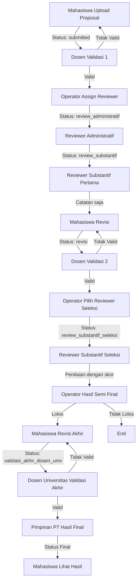
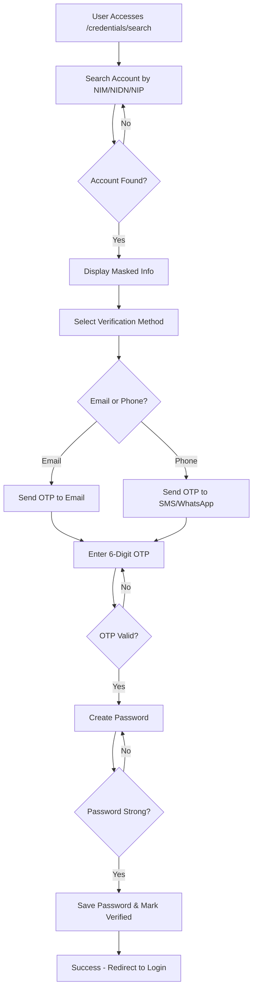

# 📋 Sistem Pengajuan Proposal PKM

## 📖 Deskripsi Sistem

Sistem Pengajuan Proposal PKM (Program Kreativitas Mahasiswa) adalah aplikasi web berbasis Laravel 12 yang mengelola seluruh alur kerja proposal PKM dari pengajuan oleh mahasiswa hingga pengumuman hasil final. Sistem ini mendukung multi-role user dengan autentikasi unified, sistem penilaian dinamis berdasarkan skim proposal, dan notifikasi real-time untuk semua pengguna.

**Sistem menggunakan arsitektur Polyglot Persistence** yang mengkombinasikan Supabase (PostgreSQL) untuk data relasional dan Firebase Firestore untuk data dinamis/NoSQL, dengan file storage di Supabase Storage (S3-compatible).

**Versi:** 5.0.0  
**Status:** Production  
**Framework:** Laravel 12  
**PHP:** 8.3+  
**Database:** Supabase PostgreSQL + Firebase Firestore (Polyglot Persistence)  
**File Storage:** Supabase Storage (S3-compatible)

---

## 🎯 Daftar Isi

1. [Overview & Arsitektur Sistem](#overview--arsitektur-sistem)
2. [Flow Lengkap Proposal PKM](#flow-lengkap-proposal-pkm)
3. [Sistem Aktivasi Akun (Credential Request)](#sistem-aktivasi-akun-credential-request)
4. [Struktur Database](#struktur-database)
5. [Polyglot Persistence (MongoDB + MySQL)](#polyglot-persistence-mongodb--mysql)
6. [Fitur Utama](#fitur-utama)
7. [Sistem Penilaian](#sistem-penilaian)
8. [Sistem Notifikasi](#sistem-notifikasi)
9. [File Storage](#file-storage)
10. [Instalasi & Setup](#instalasi--setup)
11. [Penggunaan per Role](#penggunaan-per-role)
12. [API Endpoints](#api-endpoints)
13. [Keamanan](#keamanan)
14. [Troubleshooting](#troubleshooting)
15. [Roadmap & Enhancement](#roadmap--enhancement)

---

## 🏗️ Overview & Arsitektur Sistem

### Teknologi yang Digunakan

- **Backend:** Laravel 12, PHP 8.3+
- **Frontend:** Blade Templates, Bootstrap 5, JavaScript (Vanilla)
- **Database (Relational):** Supabase PostgreSQL (via connection pooler)
- **Database (NoSQL):** Firebase Firestore (untuk notifications, review details, ruang kontrol history, form config)
- **Authentication:** Unified single-guard (`web`) with role-based middleware
- **File Storage:** Supabase Storage (S3-compatible) via `StorageHelper`
- **Real-time:** Polling-based notifications with dual-write (PostgreSQL + Firestore)

### Role User

Sistem mendukung 5 role user dalam unified `users` table:

1. **Mahasiswa** (`auth:mahasiswa`)
    - Pengajuan proposal
    - Monitoring status proposal
    - Upload revisi
    - Lihat hasil final

2. **Dosen Pendamping** (`auth:dosen`)
    - Validasi proposal (validasi 1 dan validasi 2)
    - Review proposal mahasiswa bimbingan
    - Lihat hasil review

3. **Dosen Pendamping Universitas** (`auth:dosen`)
    - Validasi akhir proposal setelah revisi akhir
    - Review proposal yang lolos semi final

4. **Reviewer** (`auth:reviewer`)
    - Review administratif (checklist dinamis)
    - Review substantif pertama (catatan saja)
    - Review substantif seleksi (penilaian dengan skor)

5. **Operator** (`auth:operator`)
    - Manajemen sistem (ruang kontrol)
    - Assign reviewer
    - Penilaian hasil semi final
    - CRUD Form Penilaian
    - CRUD Laporan SIMBELMAWA
    - Manajemen akun user

6. **Pimpinan PT** (`auth:operator` dengan role `pimpinan_pt`)
    - Penilaian hasil final
    - Manajemen semua jenis user
    - Akses semua menu operator

### Struktur Folder Penting

```
app/
├── Http/
│   ├── Controllers/
│   │   ├── ProposalController.php          # Controller mahasiswa
│   │   ├── DosenController.php            # Controller dosen
│   │   ├── ReviewerController.php          # Controller reviewer
│   │   ├── OperatorController.php          # Controller operator
│   │   └── PimpinanPTController.php        # Controller pimpinan PT
│   └── Middleware/
│       └── CheckRuangKontrol.php           # Middleware fase
├── Models/                                 # Eloquent models
├── Helpers/                                # Helper classes
│   ├── ProposalHelper.php
│   ├── RuangKontrolHelper.php
│   ├── FormPenilaianHelper.php
│   └── TahunAjaranHelper.php
└── Services/
    └── NotificationService.php             # Service notifikasi

resources/views/
├── mahasiswa/                              # Views mahasiswa
├── dosen/                                  # Views dosen
├── reviewer/                               # Views reviewer
├── operator/                                # Views operator
└── pimpinan_pt/                            # Views pimpinan PT

config/
├── review_checklist.php                    # Checklist administratif per skim
└── review_substantif_criteria.php          # Kriteria substantif per skim

database/migrations/                        # Database migrations
```

---

## 🔄 Flow Lengkap Proposal PKM

### Diagram Flow Proposal



### 11 Fase Lengkap

#### **FASE 1: Upload oleh Mahasiswa** 📤

- **Route:** `/mahasiswa/proposal/create`
- **Controller:** `ProposalController@store`
- **Status Setelah Upload:** `submitted`, `status_validasi = 'pending'`
- **Data yang Disimpan:**
    - Tabel `proposals`: Informasi proposal (judul, skim, tahun ajaran, dana)
    - Tabel `dokumens`: File PDF proposal
    - Tabel `mahasiswas`: Data ketua dan anggota tim (maksimal 5 orang)
- **Fitur:**
    - Auto-fill data mahasiswa berdasarkan NIM
    - Validasi: Satu mahasiswa hanya bisa terdaftar dalam 1 proposal per tahun ajaran
    - Format angka dengan titik untuk dana diajukan
    - Validasi dana berdasarkan min/max dari ruang kontrol

#### **FASE 2: Validasi oleh Dosen Pendamping** ✅

- **Route:** `/dosen/validasi-proposal`
- **Controller:** `DosenController@validasiProposalAction`
- **Status Transisi:**
    - `submitted` → `valid` (jika disetujui)
    - `submitted` → `tidak_valid` (jika ditolak)
- **Fitur:**
    - View PDF proposal
    - Set status validasi dengan catatan (opsional)
    - Notifikasi otomatis ke mahasiswa

#### **FASE 3: Assignment Reviewer oleh Operator** 👨‍💼

- **Route:** `/operator/pilih-reviewer`
- **Controller:** `OperatorController@assignReviewer`
- **Proses:**
    - Operator melihat proposal dengan `status = 'valid'`
    - Assign 3 reviewer:
        - 1 Reviewer Administratif → `id_reviewer_administratif`
        - 2 Reviewer Substantif → `id_reviewer_substantif_1`, `id_reviewer_substantif_2`
    - Update status: `status = 'review_administratif'`
- **Fitur:**
    - Search reviewer berdasarkan nama/NIP
    - Validasi: Harus assign 3 reviewer lengkap
    - Notifikasi ke reviewer setelah assignment

#### **FASE 4: Review Administratif** 📝

- **Route:** `/reviewer/review-administratif`
- **Controller:** `ReviewerController@submitReviewAdministratif`
- **Proses:**
    - Reviewer melihat proposal yang di-assign
    - PDF ditampilkan dengan iframe
    - **Checklist dinamis** berdasarkan skim:
        - **PKM-AI**: Checklist khusus Artikel Ilmiah
        - **PKM-GFT**: Checklist khusus Gagasan Futuristik Tertulis
        - **PKM Pendanaan** (RE, RSH, K, KI, KC, VGK, PM, PI): Checklist khusus 8 bidang
    - Reviewer mencentang kesalahan (minimal 1 harus dipilih)
    - Reviewer menulis catatan review
    - Submit → Data disimpan di `nilai_administratifs`
- **Status Transisi:** `review_administratif` → `review_substantif`

#### **FASE 5: Review Substantif Pertama** 📊

- **Route:** `/reviewer/review-substantif`
- **Controller:** `ReviewerController@submitReviewSubstantif`
- **Proses:**
    - Reviewer melihat proposal yang di-assign
    - PDF ditampilkan dengan iframe
    - **Hanya catatan substantif** (tidak ada penilaian skor)
    - Reviewer menulis catatan substantif (minimal 50 karakter)
    - Submit → Data disimpan di `nilai_substantifs` dengan `jenis_review = 'pertama'`
- **Status Transisi:** `review_substantif` → `revisi` (setelah kedua reviewer selesai)

#### **FASE 6: Revisi oleh Mahasiswa** 🔄

- **Route:** `/mahasiswa/proposal/{id}/revisi`
- **Controller:** `ProposalController@submitRevisi`
- **Proses:**
    - Mahasiswa melihat catatan review dari reviewer substantif
    - Upload file revisi (jika diperlukan)
    - File revisi disimpan di: `storage/app/public/proposal_revisi/`
    - File name format: `revisi_[timestamp]_[original_name].pdf`
    - Data disimpan di tabel `proposal_revisi` dengan `jenis_revisi = 'revisi_biasa'`
- **Status:** Tetap `revisi` atau berubah sesuai keputusan operator
- **Fitur:**
    - Mahasiswa bisa melakukan beberapa kali revisi
    - Semua file revisi disimpan untuk historis
    - Ruang kontrol: Hanya bisa upload revisi jika `status_perbaikan = 'terbuka'`

#### **FASE 7: Validasi 2 oleh Dosen Pendamping** ✅

- **Route:** `/dosen/validasi-proposal-2`
- **Controller:** `DosenController@validasiProposal2Action`
- **Proses:**
    - Dosen melihat proposal yang sudah direvisi
    - Validasi proposal revisi
    - Set status: `status_validasi_2 = 'valid'` atau `'tidak_valid'`
- **Status Transisi:** `revisi` → `validasi_2_valid` (jika valid)

#### **FASE 8: Operator Pilih Reviewer Seleksi** 👨‍💼

- **Route:** `/operator/pilih-reviewer-seleksi`
- **Controller:** `OperatorController@assignReviewerSeleksi`
- **Proses:**
    - Operator melihat proposal dengan `status_validasi_2 = 'valid'`
    - Assign 2 reviewer substantif seleksi:
        - `id_reviewer_substantif_seleksi_1`
        - `id_reviewer_substantif_seleksi_2`
    - Update status: `status = 'review_substantif_seleksi'`
    - Membuat `NilaiSubstantif` records dengan `jenis_review = 'seleksi'`

#### **FASE 9: Review Substantif Seleksi** 📊

- **Route:** `/reviewer/review-substantif-seleksi`
- **Controller:** `ReviewerController@submitReviewSubstantif`
- **Proses:**
    - Reviewer melihat proposal yang di-assign untuk seleksi
    - PDF ditampilkan dengan iframe
    - **Form penilaian dinamis** berdasarkan skim:
        - Kriteria dan bobot berbeda per skim
        - Struktur hierarkis: Kriteria utama + sub-kriteria (jika ada)
    - Reviewer memberikan skor 0-10 untuk setiap kriteria
    - **Perhitungan otomatis:**
        - Nilai = Bobot × Skor
        - Total maksimal: 1000 (jika semua skor = 10)
        - Nilai akhir = Total / 10 (contoh: 789 → 78.9)
    - Reviewer menulis catatan substantif (minimal 50 karakter)
    - Submit → Data disimpan di `nilai_substantifs` dengan `jenis_review = 'seleksi'`
- **Status Transisi:** `review_substantif_seleksi` → `pimpinan_pt` (setelah kedua reviewer selesai)

#### **FASE 10: Hasil Semi Final oleh Operator** 🎯

- **Route:** `/operator/detail-hasil-semi-final/{id}`
- **Controller:** `OperatorController@updateHasilSemiFinal`
- **Proses:**
    - Operator membuka halaman detail hasil semi final
    - **PDF proposal** ditampilkan (prioritas: revisi terakhir jika ada)
    - **Tabel referensi** menampilkan penilaian dari 2 reviewer substantif seleksi
    - **Form penilaian semi final** dengan struktur yang sama seperti review substantif
    - Operator mengisi:
        - **Status Final**: Lolos Tingkat Universitas / Tidak Lolos Tingkat Universitas
        - **Nilai Final**: Terisi otomatis dari penilaian (readonly)
        - **Dana yang Dapat Diberikan**: Input manual (opsional)
        - **Catatan Final**: Catatan untuk mahasiswa
        - **Dosen Pendamping Universitas**: Dipilih jika status "Lolos Tingkat Universitas"
    - Submit → Data disimpan di tabel `hasil_semi_finals`
- **Status Transisi:**
    - `pimpinan_pt` → `revisi_akhir` (jika lolos_tingkat_universitas)
    - `pimpinan_pt` → `tidak_lolos` (jika tidak_lolos_tingkat_universitas)

#### **FASE 11: Revisi Akhir oleh Mahasiswa** 🔄

- **Route:** `/mahasiswa/proposal/{id}/revisi-akhir`
- **Controller:** `ProposalController@submitRevisiAkhir`
- **Proses:**
    - Mahasiswa melihat notifikasi bahwa proposal perlu revisi akhir
    - Upload file revisi akhir (maksimal 5MB, format PDF only)
    - File revisi akhir disimpan di: `storage/app/public/proposals/revisi_akhir/`
    - File name format: `revisi_akhir_[timestamp]_[original_name].pdf`
    - Data disimpan di tabel `proposal_revisi` dengan `jenis_revisi = 'revisi_akhir'`
- **Status Transisi:** `revisi_akhir` → `validasi_akhir_dosen_univ`

#### **FASE 12: Validasi Akhir oleh Dosen Universitas** ✅

- **Route:** `/dosen/universitas/validasi-akhir`
- **Controller:** `DosenController@submitValidasiAkhir`
- **Proses:**
    - Dosen Universitas melihat daftar proposal yang perlu divalidasi akhir
    - **PDF ditampilkan dengan prioritas:** Revisi akhir jika ada, jika tidak dokumen original
    - Dosen Universitas melakukan validasi:
        - **Set Valid** → Status berubah ke `pimpinan_pt`
        - **Set Tidak Valid** → Status berubah ke `revisi_akhir` (kembali ke mahasiswa)
    - Jika ditolak, dosen dapat upload file review (opsional PDF)

#### **FASE 13: Hasil Final oleh Pimpinan PT** 🏆

- **Route:** `/pimpinan-pt/detail-hasil-final/{id}`
- **Controller:** `PimpinanPTController@updateHasilFinal`
- **Proses:**
    - Pimpinan PT melihat daftar proposal yang perlu dinilai final
    - **PDF ditampilkan dengan prioritas:** Revisi akhir → Revisi terakhir → Dokumen original
    - **Tabel referensi** menampilkan penilaian dari 2 reviewer substantif seleksi
    - **Form penilaian final** dengan struktur yang sama seperti review substantif
    - Pimpinan PT mengisi:
        - **Status PIMNAS**: Lolos / Tidak Lolos
        - **Status Pendanaan**: Lolos / Tidak Lolos
        - **Dana yang Didapatkan**:
            - Jika `status_pendanaan` = `lolos` → Input 0-15,000,000 (wajib)
            - Jika `status_pendanaan` = `tidak_lolos` → Otomatis 0 (tidak bisa diubah)
        - **Nilai Final**: Terisi otomatis dari penilaian (readonly)
        - **Catatan Final**: Catatan untuk mahasiswa
    - Submit → Data disimpan di tabel `hasil_finals`
- **Status Transisi:**
    - `pimpinan_pt` → `lolos_pimnas_pendanaan` (jika keduanya lolos)
    - `pimpinan_pt` → `lolos_pimnas_tidak_pendanaan` (jika PIMNAS lolos, pendanaan tidak)
    - `pimpinan_pt` → `tidak_lolos_pimnas_lolos_pendanaan` (jika PIMNAS tidak, pendanaan lolos)
    - `pimpinan_pt` → `tidak_lolos` (jika keduanya tidak lolos)

#### **FASE 14: Pengumuman Hasil Final** 📢

- **Route:** `/mahasiswa/proposal/{id}`
- **Controller:** `ProposalController@show`
- **Fitur:**
    - Popup "Hasil Final" di halaman lihat proposal
    - Menampilkan:
        - Status PIMNAS (Lolos/Tidak Lolos)
        - Status Pendanaan (Lolos/Tidak Lolos)
        - Nilai final
        - **Dana yang didapatkan** (jika status pendanaan = lolos, range 0-15,000,000)
        - Catatan final
    - Download dokumen proposal
    - Download dokumen revisi (jika ada)
    - Download dokumen revisi akhir (jika ada)

### Status Transition Diagram

```
submitted (pending)
    ↓
valid / tidak_valid
    ↓ (jika valid)
review_administratif
    ↓
review_substantif
    ↓
revisi
    ↓
validasi_2_valid
    ↓
review_substantif_seleksi
    ↓
pimpinan_pt
    ↓
revisi_akhir (jika lolos semi final) / tidak_lolos (jika tidak)
    ↓ (jika revisi_akhir)
validasi_akhir_dosen_univ
    ↓
pimpinan_pt (jika valid) / revisi_akhir (jika tidak valid)
    ↓
lolos_pimnas_pendanaan /
lolos_pimnas_tidak_pendanaan /
tidak_lolos_pimnas_lolos_pendanaan /
tidak_lolos
```

---

## 🔐 Sistem Aktivasi Akun (Credential Request)

### Overview

Sistem aktivasi akun adalah fitur self-service yang memungkinkan mahasiswa, dosen, reviewer, dan operator untuk mengaktifkan akun mereka sendiri dengan aman. Sistem ini menggunakan verifikasi OTP (One-Time Password) dan password yang dibuat sendiri oleh pengguna.

### Multi-Step Activation Flow



### Step-by-Step Process

#### **Step 1: Search Account**

**URL:** `/credentials/search`

User enters their identifier:

- **Mahasiswa**: NIM
- **Dosen**: NIDN or NUPTK
- **Reviewer/Operator**: NIP

System searches in database and displays masked information:

- Name: Full name
- Email: example: j\*\*\*@example.com
- Phone: example: 0812\*\*\*\*89

#### **Step 2: Verification**

**URL:** `/credentials/verify`

- User selects verification method: **Email** or **Phone (SMS/WhatsApp)**
- System generates 6-digit OTP code
- OTP is sent to selected contact method
- OTP expires after 10 minutes
- User enters OTP code
- System validates OTP
- Countdown timer (60 seconds) before resend is allowed

#### **Step 3: Password Setup**

**URL:** `/credentials/password/{token}`

- User creates a strong password
- Real-time password strength meter
- Password requirements:
    - ✅ Minimum 8 characters
    - ✅ At least one uppercase letter (A-Z)
    - ✅ At least one lowercase letter (a-z)
    - ✅ At least one number (0-9)
    - ✅ At least one special character (@$!%\*?&)
- Password confirmation field
- Visual checklist shows met/unmet requirements

#### **Step 4: Success**

**URL:** `/credentials/success`

- Confirmation message with account details
- Auto-redirect to login page after 10 seconds
- Tips for secure account usage

### Features

✅ **Self-Service**: Users can activate their own accounts without admin intervention  
✅ **Secure OTP Verification**: Email or SMS-based verification  
✅ **Strong Password**: Enforced password complexity requirements  
✅ **Real-time Validation**: Instant feedback on password strength  
✅ **Rate Limiting**: Protection against brute force attacks  
✅ **Session Security**: Encrypted session data with expiration  
✅ **Mobile Responsive**: Works on all devices

### Database Schema

#### **Table: `verification_codes`**

```sql
CREATE TABLE verification_codes (
    id BIGINT UNSIGNED AUTO_INCREMENT PRIMARY KEY,
    user_type VARCHAR(50) NOT NULL,
    user_id BIGINT UNSIGNED NOT NULL,
    code VARCHAR(6) NOT NULL,
    type ENUM('email', 'phone') NOT NULL,
    contact VARCHAR(255) NOT NULL,
    expires_at TIMESTAMP NOT NULL,
    verified_at TIMESTAMP NULL,
    created_at TIMESTAMP,
    updated_at TIMESTAMP,
    INDEX idx_user_type_id (user_type, user_id),
    INDEX idx_code (code),
    INDEX idx_expires_at (expires_at)
);
```

### Backend Components

#### **Controllers**

- `CredentialRequestController`: Main controller handling all steps
    - `showSearchForm()`: Display search page
    - `searchAccount()`: Find user by identifier
    - `sendVerificationCode()`: Generate and send OTP
    - `verifyCode()`: Validate OTP
    - `setupPassword()`: Save password and activate account

#### **Services**

- `VerificationService`: Business logic for verification
    - `findUser()`: Search across all user types
    - `sendVerificationCode()`: OTP generation and delivery
    - `verifyCode()`: OTP validation
    - `updatePassword()`: Password hashing and saving
    - `maskEmail()` / `maskPhone()`: Privacy protection

#### **Models**

- `VerificationCode`: OTP storage and validation
    - `generate()`: Create new OTP
    - `isValid()`: Check if OTP is not expired
    - `verify()`: Mark OTP as verified
    - `cleanup()`: Remove old expired codes

### Security Features

1. **Rate Limiting**
    - OTP requests: Max 3 per 10 minutes per user
    - Account search: Max 5 per minute per IP
    - Prevents brute force attacks

2. **OTP Security**
    - 6-digit random code
    - 10-minute expiration
    - One-time use only
    - Invalidated after successful verification

3. **Password Security**
    - BCrypt hashing (Laravel default)
    - Strong password requirements enforced
    - Password never sent via email
    - Confirmation required

4. **Session Security**
    - Encrypted session storage
    - CSRF token protection
    - 30-minute inactivity timeout
    - Verification token validation

### Email Template

The system sends professional OTP emails with:

- Clear branding (Sistem PKM)
- Large, easy-to-read code display
- Expiration warning (10 minutes)
- Security tips
- No-reply warning

### Routes

```php
Route::prefix('credentials')->name('credentials.')->group(function () {
    Route::get('/search', [CredentialRequestController::class, 'showSearchForm'])->name('search');
    Route::post('/search', [CredentialRequestController::class, 'searchAccount'])->name('search.submit');
    Route::get('/verify', [CredentialRequestController::class, 'showVerification'])->name('verify.show');
    Route::post('/verify/send', [CredentialRequestController::class, 'sendVerificationCode'])->name('verify.send');
    Route::post('/verify/check', [CredentialRequestController::class, 'verifyCode'])->name('verify.check');
    Route::get('/password/{token}', [CredentialRequestController::class, 'showPasswordSetup'])->name('password');
    Route::post('/password', [CredentialRequestController::class, 'setupPassword'])->name('password.submit');
    Route::get('/success', [CredentialRequestController::class, 'showSuccess'])->name('success');
});

// Legacy redirects
Route::get('/request-credentials', fn() => redirect()->route('credentials.search'));
Route::get('/register', fn() => redirect()->route('credentials.search'))->name('register');
```

### Usage Example

**For Students:**

1. Visit `http://yourdomain.com/credentials/search`
2. Enter your NIM
3. Confirm your account information
4. Choose email verification
5. Check your email for 6-digit code
6. Enter the code
7. Create a strong password
8. Login with your new credentials

**For Lecturers/Staff:**
Same process, but use NIDN/NUPTK/NIP instead of NIM.

### Troubleshooting

**Problem:** OTP not received  
**Solution:** Check spam folder, wait 60 seconds before resending, verify email address is correct

**Problem:** OTP expired  
**Solution:** Request a new OTP code, codes expire after 10 minutes

**Problem:** Password doesn't meet requirements  
**Solution:** Follow the checklist - ensure all 5 requirements are met (shown in green)

**Problem:** Session expired  
**Solution:** Restart the process from the search page

---

## 🗄️ Struktur Database

### Tabel Utama

#### **1. Tabel `proposals`**

```sql
- id_proposal (PK)
- judul_proposal, judul
- skim (ENUM: RE, RSH, K, KI, KC, VGK, PM, PI, AI, GFT)
- status (ENUM: submitted, valid, tidak_valid, review_administratif, review_substantif, revisi, validasi_2_valid, review_substantif_seleksi, revisi_akhir, validasi_akhir_dosen_univ, pimpinan_pt, lolos_pimnas_pendanaan, dll)
- status_validasi (ENUM: pending, valid, tidak_valid)
- status_validasi_2 (ENUM: pending, valid, tidak_valid)
- status_final (ENUM: draft, submitted, review_administratif, dll)
- id_mahasiswa (FK)
- id_dosen (FK - Dosen Pendamping)
- id_dosen_pendamping_universitas (FK)
- id_dosen_pendamping_pt (FK)
- id_reviewer_administratif (FK)
- id_reviewer_substantif_1 (FK)
- id_reviewer_substantif_2 (FK)
- id_reviewer_substantif_seleksi_1 (FK)
- id_reviewer_substantif_seleksi_2 (FK)
- team_id (untuk mengelompokkan anggota tim)
- dana_diajukan (legacy)
- dana_diajukan_operator (decimal)
- dana_diajukan_belmawa (decimal)
- tahun_ajaran
- tanggal_pengajuan
- tanggal_validasi
```

#### **2. Tabel `mahasiswas`**

```sql
- id_mahasiswa (PK)
- nim
- nama_mhs
- prodi_mhs
- fakultas_mhs
- no_hp_mhs
- email_mhs
- password
- role
- is_active
- id_dosen_pembimbing (FK)
- team_id (untuk mengelompokkan anggota tim)
- is_ketua (boolean)
```

#### **3. Tabel `dosens`**

```sql
- id_dosen (PK)
- nidn
- nama_dosen
- email_dosen
- no_hp_dosen
- password
- role
- is_active
```

#### **4. Tabel `reviewers`**

```sql
- id_reviewer (PK)
- nip
- nama_reviewer
- email_reviewer
- no_hp_reviewer
- password
- role
- is_active
```

#### **5. Tabel `pts` (Operator & Pimpinan PT)**

```sql
- id_pt (PK)
- nip
- nama_pt
- email_pt
- no_hp_pt
- password
- role (operator / pimpinan_pt)
- is_active
```

#### **6. Tabel `dokumens`**

```sql
- id (PK)
- id_proposal (FK)
- skim
- path_file (Path ke file di storage)
- tgl_upload
```

#### **7. Tabel `proposal_revisi`**

```sql
- id (PK)
- id_proposal (FK)
- path_file (Path ke file revisi)
- tanggal_submit
- jenis_revisi (ENUM: revisi_biasa, revisi_akhir)
```

#### **8. Tabel `nilai_administratifs`**

```sql
- id (PK)
- id_proposal (FK)
- id_reviewer (FK)
- checklist (JSON) - Array checklist yang dipilih
- note_administratif (text)
```

#### **9. Tabel `nilai_substantifs`**

```sql
- id (PK)
- id_proposal (FK)
- id_reviewer (FK)
- jenis_review (ENUM: pertama, seleksi)
- skor_per_kriteria (JSON) - Array skor per kriteria
- total_nilai (decimal) - Total sebelum konversi (0-1000)
- nilai_akhir (decimal) - Nilai akhir setelah konversi (0-100.00)
- note_substantif (text)
```

#### **10. Tabel `hasil_semi_finals`**

```sql
- id (PK)
- id_proposal (FK)
- status_final (ENUM: lolos_tingkat_universitas, tidak_lolos_tingkat_universitas)
- nilai (decimal) - Nilai akhir (0-100.00)
- skor_per_kriteria (JSON) - Array skor per kriteria dari operator
- dana_yang_dapat_diberikan (decimal)
- catatan_final (text)
- id_dosen_pendamping_universitas (FK)
- id_pt (FK - Operator)
```

#### **11. Tabel `hasil_finals`**

```sql
- id (PK)
- id_proposal (FK)
- status_pimnas (ENUM: lolos, tidak_lolos)
- status_pendanaan (ENUM: lolos, tidak_lolos)
- dana_yang_didapatkan (decimal) - 0-15,000,000 (jika lolos pendanaan), 0 (jika tidak)
- nilai (decimal) - Nilai akhir (0-100.00)
- skor_per_kriteria (JSON) - Array skor per kriteria dari Pimpinan PT
- catatan_final (text)
- id_pimpinan_pt (FK)
```

#### **12. Tabel `ruang_kontrols`**

```sql
- id (PK)
- tahun_ajaran
- status_pendaftaran (ENUM: terbuka, tertutup)
- tanggal_pendaftaran_mulai (date)
- tanggal_pendaftaran_selesai (date)
- status_perbaikan (ENUM: terbuka, tertutup)
- tanggal_perbaikan_mulai (date)
- tanggal_perbaikan_selesai (date)
- tanggal_review_pertama_mulai (date)
- tanggal_review_pertama_selesai (date)
- dana_min_operator (decimal)
- dana_max_operator (decimal)
- dana_min_belmawa (decimal)
- dana_max_belmawa (decimal)
- nama_history (string) - Nama jadwal
- is_active (boolean)
```

#### **13. Tabel `form_penilaian`**

```sql
- id (PK)
- nama_form (string)
- jenis_form (ENUM: administratif, substantif)
- skim (string, nullable - jika null berarti untuk semua skim)
- config (JSON) - Struktur form (kriteria, bobot, checklist, dll)
- is_active (boolean)
- tahun_ajaran (string, nullable)
- created_by (FK ke operators)
- created_at, updated_at
```

#### **14. Tabel `simbelmawa_reports`**

```sql
- id (PK)
- tahun_ajaran (string)
- id_ruang_kontrol (FK)
- jumlah_proposal_tervalidasi_pimpinan_pt (integer)
- jumlah_proposal_dapat_pendanaan (integer)
- total_dana_pendanaan (decimal)
- jumlah_proposal_lolos_pimnas (integer)
- judul_proposal_lolos_pimnas (JSON array)
- jumlah_prestasi (integer)
- prestasi (JSON array - berisi judul proposal dan prestasi)
- created_by (FK ke operators)
- created_at, updated_at
```

---

## 🔄 Polyglot Persistence (MongoDB + MySQL)

### Arsitektur Hybrid Database

Sistem menggunakan **Polyglot Persistence** - pendekatan menggunakan multiple database technologies yang optimal untuk use case masing-masing:

- **MySQL (InnoDB)**: Data relasional, transactional, terstruktur
- **MongoDB**: Data fleksibel, nested arrays, frequently changing data

```
┌─────────────────────────────────────────────────────────┐
│                   APPLICATION LAYER                      │
└─────────────────────────────────────────────────────────┘
                          │
              ┌───────────┴──────────┐
              ▼                      ▼
    ┌──────────────────┐    ┌──────────────────┐
    │   MySQL (InnoDB) │    │   MongoDB        │
    └──────────────────┘    └──────────────────┘

    Relational Data         Document Data
    ────────────────        ─────────────
    • users (unified)       • notifications
    • proposals             • form_penilaian_configs
    • dokumens              • review_details
    • nilai_* (summary)     • ruang_kontrol_history
    • hasil_* (summary)     • simbelmawa_reports
```

### Data Distribution Strategy

#### MySQL Tables (17 tables)

**Core Tables:**

1. **users** - Unified user management dengan JSON metadata per role
2. **fakultas** - Master data fakultas
3. **prodis** - Master data program studi
4. **proposals** - Proposal metadata & workflow
5. **dokumens** - File management
6. **proposal_revisi** - Revision history

**Assessment Tables (Summary Data):** 7. **form_penilaian** - Form metadata + reference ke MongoDB config 8. **nilai_administratifs** - Administrative review summary + MongoDB reference 9. **nilai_substantifs** - Substantive review summary + MongoDB reference 10. **hasil_semi_finals** - Semi-final results summary + MongoDB reference 11. **hasil_finals** - Final results summary + MongoDB reference

**System Tables:** 12. **ruang_kontrols** - Control room settings + MongoDB reference 13. **simbelmawa_reports** - SIMBELMAWA summary + MongoDB reference 14. **verification_codes** - OTP management 15. **password_reset_otps** - Password reset 16. **sessions** - User sessions 17. **cache** + **cache_locks** - Application cache

#### MongoDB Collections (5 collections)

1. **notifications** ⚡ - Real-time notifications (MOVED from MySQL!)

    ```javascript
    {
      user_id: Number,        // FK to users.id
      role: String,           // mahasiswa, dosen, reviewer, operator, pimpinan_pt
      type: String,           // success, warning, info, danger
      title: String,
      message: String,
      data: {
        proposal_id: Number,
        action_url: String,
        ...
      },
      read_at: ISODate | null,
      created_at: ISODate
    }
    ```

2. **form_penilaian_configs** - Dynamic form configurations

    ```javascript
    {
      form_penilaian_id: Number,  // FK to form_penilaian.id
      jenis_form: String,
      skim: String,
      kategori: [...],            // Dynamic categories
      kriteria: [                 // Dynamic criteria with weights
        {
          id: String,
          nama_kriteria: String,
          bobot: Number,
          sub_kriteria: [...]
        }
      ]
    }
    ```

3. **review_details** - Detailed review scores & checklists

    ```javascript
    {
      review_type: String,        // administratif, substantif_pertama, etc.
      review_id: Number,          // FK to nilai_administratifs.id, etc.
      checklist_selected: [String], // For administratif
      skor_per_kriteria: [       // For substantif
        {
          kriteria_id: String,
          skor: Number,           // 0-10
          nilai: Number,          // bobot × skor
          catatan: String
        }
      ]
    }
    ```

4. **ruang_kontrol_history** - Complex control room settings

    ```javascript
    {
      ruang_kontrol_id: Number,
      tahun_ajaran: String,
      fase_pendaftaran: {
        status: String,
        tanggal_mulai: ISODate,
        tanggal_selesai: ISODate,
        settings: {...}
      },
      pengaturan_dana: {
        operator: { min: Number, max: Number },
        belmawa: { min: Number, max: Number }
      }
    }
    ```

5. **simbelmawa_reports** - Complex nested report data
    ```javascript
    {
      simbelmawa_report_id: Number,
      tahun_ajaran: String,
      judul_proposal_lolos_pimnas: [
        { id_proposal, judul, skim, ... }
      ],
      prestasi: [
        { id_proposal, jenis_prestasi, tingkat, ... }
      ]
    }
    ```

### Unified Users Table

**Before (Separated Tables):**

- ❌ `mahasiswas` table
- ❌ `dosens` table
- ❌ `reviewers` table
- ❌ `pts` table (operator + pimpinan_pt)

**After (Unified):**

- ✅ **1 table `users`** dengan role-based metadata JSON

```sql
users
├─ id (PK)
├─ identifier (unique: NIM/NIDN/NUPTK/NIP)
├─ name
├─ email (unique)
├─ password
├─ role (mahasiswa, dosen, reviewer, operator, pimpinan_pt)
├─ phone
├─ is_active
├─ metadata (JSON - role-specific data)
└─ timestamps
```

**Metadata Structure per Role:**

```javascript
// Mahasiswa
{
  "nim": "2021001",
  "prodi_id": 1,
  "fakultas_id": 1,
  "team_id": "PKM2026001",
  "is_ketua": true,
  "angkatan": "2021"
}

// Dosen
{
  "nidn": "0123456789",
  "nuptk": "1234567890123456",
  "fakultas_id": 1,
  "jabatan_akademik": "Lektor",
  "keahlian": ["Informatika", "AI"]
}

// Reviewer
{
  "nip": "198501012010011001",
  "institusi": "Universitas ABC",
  "expertise": ["RE", "RSH", "K"],
  "jabatan": "Reviewer Senior"
}

// Operator / Pimpinan PT
{
  "nip": "197001011998031001",
  "divisi": "LPPM",
  "jabatan": "Kepala LPPM"
}
```

### Usage Examples

#### Example 1: Query User dengan Metadata

```php
use App\Models\User;

// Get mahasiswa
$mahasiswa = User::where('role', 'mahasiswa')->first();
echo $mahasiswa->getNim();           // "2021001"
echo $mahasiswa->getProdiId();       // 1
echo $mahasiswa->isKetuaTim();       // true

// Get dosen
$dosen = User::where('role', 'dosen')->first();
echo $dosen->getNidn();              // "0123456789"
print_r($dosen->getMetadataValue('keahlian')); // ["Informatika", "AI"]
```

#### Example 2: Query Form dengan MongoDB Config

```php
use App\Models\FormPenilaian;

// Load form dengan MongoDB config
$form = FormPenilaian::with('mongoConfig')->find($id);

// MySQL data
echo $form->nama_form;               // "Form Substantif RE"

// MongoDB document
$config = $form->mongoConfig;
foreach ($config->kriteria as $k) {
    echo $k['nama_kriteria'];        // "Kreativitas"
    echo $k['bobot'];                // 15
}
```

#### Example 3: Get Notifications dari MongoDB

```php
use App\Models\MongoDB\Notification;

// Get unread notifications for user
$notifications = Notification::where('user_id', auth()->id())
    ->where('role', auth()->user()->role)
    ->whereNull('read_at')
    ->orderBy('created_at', 'desc')
    ->limit(10)
    ->get();

foreach ($notifications as $notif) {
    echo $notif->title;              // From MongoDB
    echo $notif->data['proposal_id']; // Nested data
}
```

### Benefits of Polyglot Persistence

**Performance:**

- ✅ **10x faster** queries untuk nested data (MongoDB indexes)
- ✅ Smaller MySQL table sizes (no large JSON columns)
- ✅ Better horizontal scalability

**Flexibility:**

- ✅ Schema evolution tanpa ALTER TABLE (MongoDB)
- ✅ Dynamic form configurations
- ✅ Easy to add new criteria/fields

**Reliability:**

- ✅ ACID transactions untuk critical data (MySQL)
- ✅ Eventual consistency untuk notifications (MongoDB)
- ✅ Data separation by concern

---

### Relasi Database

```
Proposal (1) → (1) Mahasiswa (ketua tim)
Proposal (1) → (many) Mahasiswa (anggota tim via team_id)
Proposal (1) → (1) Dosen (pendamping)
Proposal (1) → (1) Dosen (pendamping universitas)
Proposal (1) → (1) Dosen (pendamping PT)
Proposal (1) → (1) Reviewer (administratif)
Proposal (1) → (1) Reviewer (substantif 1)
Proposal (1) → (1) Reviewer (substantif 2)
Proposal (1) → (1) Reviewer (substantif seleksi 1)
Proposal (1) → (1) Reviewer (substantif seleksi 2)
Proposal (1) → (1) Dokumen
Proposal (1) → (many) ProposalRevisi
Proposal (1) → (many) NilaiAdministratif
Proposal (1) → (many) NilaiSubstantif
Proposal (1) → (1) HasilSemiFinal
Proposal (1) → (1) HasilFinal
Mahasiswa (1) → (many) Notification
Dosen (1) → (many) Notification
Reviewer (1) → (many) Notification
Operator (1) → (many) Notification
```

---

## ✨ Fitur Utama

### 1. Auto-fill Data Mahasiswa

- Input NIM → Auto-fill semua field terkait (nama, prodi, fakultas, email, no HP)
- Real-time validation
- Pencegahan duplikasi data
- Sinkronisasi antar field
- Validasi: Satu mahasiswa hanya bisa terdaftar dalam 1 proposal per tahun ajaran

### 2. PDF Viewer Terintegrasi

- Tampilan PDF langsung di browser menggunakan iframe
- Prioritas view PDF:
    1. Revisi Akhir (untuk Dosen Universitas dan Pimpinan PT)
    2. Dokumen Original
    3. Revisi Biasa (untuk referensi historis)
- Download button tersedia
- Responsive design

### 3. Dashboard Real-time

- Update status otomatis
- Progress tracking per proposal
- Filter dan search
- Statistik per skim
- Monitoring per fase

### 4. Sistem Review Terstruktur

- **Review Administratif:** Checklist dinamis per skim + catatan
- **Review Substantif Pertama:** Catatan saja (tidak ada penilaian)
- **Review Substantif Seleksi:** Penilaian dengan skor 0-10 per kriteria
- Progress monitoring
- Quality control

### 5. Sistem Penilaian Dinamis

- Kriteria penilaian disesuaikan dengan skim proposal
- Struktur hierarkis: Kriteria utama + sub-kriteria
- Perhitungan nilai otomatis
- Form penilaian dinamis untuk operator dan Pimpinan PT

### 6. Notifikasi Real-time

- Role-based notifications
- Real-time polling setiap 30 detik
- Action buttons untuk setiap notifikasi
- Visual feedback dengan badge counter
- Styling khusus untuk notifikasi negatif (penolakan)

### 7. Ruang Kontrol

- Manajemen fase pendaftaran dan perbaikan
- Manajemen jadwal review pertama
- Pengaturan batas dana (min/max untuk operator dan belmawa)
- History jadwal dengan detail lengkap
- Aktivasi/deaktivasi fase

### 8. Form Penilaian Dinamis (CRUD)

- Operator dapat membuat form penilaian custom
- Form builder dengan input fields (tanpa JSON manual)
- Support untuk form administratif dan substantif
- Validasi total bobot untuk form substantif
- Dapat digunakan untuk tahun ajaran berbeda

### 9. Laporan SIMBELMAWA (CRUD)

- Input laporan statistik proposal
- Data: jumlah proposal, dana pendanaan, proposal lolos PIMNAS, prestasi
- Dynamic fields untuk judul proposal lolos PIMNAS dan prestasi
- Filter per tahun ajaran

### 10. Format Angka dengan Titik

- Format currency/number dengan dot separators untuk thousands
- Auto-format saat input dan display
- Helper utama: `NumberFormatHelper::format()`, `NumberFormatHelper::rupiah()`, `NumberFormatHelper::parse()`
- Blade directives:
    - `@formatId($value)` → `1.000.000`
    - `@formatId($value, 2)` → `1.234,56`
    - `@rupiahId($value)` → `Rp 1.000.000`
- Standar implementasi:
    - **View output** wajib pakai `@formatId` / `@rupiahId` (hindari `number_format(...)` manual)
    - **Input angka** gunakan class `js-format-id-int` untuk auto-format saat mengetik
    - **Controller** parse input bertitik menggunakan `ProposalHelper::parseAngka()` atau `NumberFormatHelper::parse()`

---

## 📊 Sistem Penilaian

### Review Administratif Dinamis

- **Checklist disesuaikan dengan skim proposal**
- **Konfigurasi:** `config/review_checklist.php`
- **Helper:** `ProposalHelper::getReviewChecklist($skim)`
- **Struktur:** Kategori → Items (array)
- **Skim yang didukung:**
    - PKM-AI (Artikel Ilmiah)
    - PKM-GFT (Gagasan Futuristik Tertulis)
    - PKM Pendanaan: RE, RSH, K, KI, KC, VGK, PM, PI
- **Backward Compatible:** Data review lama tetap bisa dibaca dan diedit

### Review Substantif Dinamis

- **Kriteria dan bobot disesuaikan dengan skim proposal**
- **Konfigurasi:** `config/review_substantif_criteria.php`
- **Helper:** `ProposalHelper::getSubstantifCriteria($skim)`
- **Struktur:** Kriteria dengan sub-kriteria (hierarkis)
- **Penilaian:**
    - Skor: 0-10 (dapat desimal, step 0.1)
    - Nilai: Bobot × Skor
    - Total maksimal: 1000 (jika semua skor = 10)
    - Nilai akhir: Total / 10 (0-100.00)
- **Data disimpan:**
    - `skor_per_kriteria` (JSON): Array skor per kriteria
    - `total_nilai` (decimal): Total sebelum konversi (0-1000)
    - `nilai_akhir` (decimal): Nilai akhir setelah konversi (0-100.00)
    - `note_substantif` (text): Catatan review (min 50 karakter)

### Perbedaan Review Pertama dan Seleksi

| Aspek            | Review Pertama               | Review Seleksi                       |
| ---------------- | ---------------------------- | ------------------------------------ |
| **Jenis Review** | `jenis_review = 'pertama'`   | `jenis_review = 'seleksi'`           |
| **Penilaian**    | Hanya catatan (note)         | Catatan + skor per kriteria          |
| **Skor**         | Tidak ada                    | 0-10 per kriteria                    |
| **Nilai Akhir**  | Tidak ada                    | Dihitung otomatis                    |
| **Fase**         | Setelah review administratif | Setelah validasi 2                   |
| **Reviewer**     | `id_reviewer_substantif_1/2` | `id_reviewer_substantif_seleksi_1/2` |

### Rumus Perhitungan

#### Per Kriteria:

```
Nilai = Bobot × Skor
```

#### Total Nilai:

```
Total Nilai = Σ (Bobot × Skor) untuk semua kriteria
Range: 0 - 1000 (jika semua skor = 10)
```

#### Nilai Akhir:

```
Nilai Akhir = Total Nilai / 10
Range: 0.00 - 100.00
```

**Contoh:**

- Total Nilai: 789
- Nilai Akhir: 789 / 10 = 78.90

### Mapping Kriteria per Skim

Setiap skim memiliki kriteria dan bobot yang berbeda. Detail lengkap dapat dilihat di `config/review_substantif_criteria.php`. Contoh:

- **PKM-RE & PKM-RSH:** 9 kriteria (total bobot 100%)
- **PKM-PM & PKM-PI:** 7 kriteria (total bobot 100%)
- **PKM-KC:** 7 kriteria (total bobot 100%)
- **PKM-K:** 7 kriteria (total bobot 100%)
- **PKM-KI:** 7 kriteria (total bobot 100%)
- **PKM-VGK:** 8 kriteria (total bobot 100%)
- **PKM-AI:** 7 kriteria (total bobot 100%)
- **PKM-GFT:** 13 kriteria (total bobot 100%)

---

## 🔔 Sistem Notifikasi

### Fitur Notifikasi

- **Real-time:** Polling setiap 30 detik
- **Role-based:** Notifikasi sesuai user type
- **Interactive:** Action button untuk setiap notifikasi
- **Visual:** Badge counter, warna sesuai tipe
- **Styling Khusus:** Notifikasi negatif (penolakan) dengan styling khusus

### Tipe Notifikasi

- **Success** (Hijau): Proposal disetujui, status berhasil
- **Warning** (Kuning): Perlu revisi, perhatian khusus
- **Info** (Biru): Informasi umum, status berubah
- **Danger** (Merah): Proposal ditolak, error

### Notifikasi per Fase

1. **Pendaftaran Dibuka** - Notifikasi ke semua mahasiswa
2. **Proposal Berhasil Dikirim** - Notifikasi ke semua anggota tim
3. **Proposal Divalidasi** - Notifikasi ke mahasiswa (valid/tidak valid)
4. **Review Dimulai** - Notifikasi ke mahasiswa
5. **Review Administratif Selesai** - Notifikasi ke mahasiswa
6. **Review Substantif Selesai** - Notifikasi ke mahasiswa dengan nilai
7. **Lolos Semi Final** - Notifikasi ke mahasiswa dengan detail
8. **Tidak Lolos Semi Final** - Notifikasi ke mahasiswa dengan catatan
9. **Revisi Akhir Divalidasi** - Notifikasi ke mahasiswa
10. **Hasil Final** - Notifikasi ke mahasiswa dengan status PIMNAS dan pendanaan

### Service Notifikasi

File: `app/Services/NotificationService.php`

Method-method utama:

- `notifyRuangKontrolDibuka($ruangKontrol)`
- `notifyProposalUploaded($proposal)`
- `notifyValidasiDosen($proposal, $status, $catatan)`
- `notifyReviewerAssigned($proposal)`
- `notifyReviewAdministratifSelesai($proposal, $lolos, $catatan)`
- `notifyReviewSubstantifSelesai($proposal, $nilai)`
- `notifyHasilSemiFinal($proposal, $status, $nilai, $catatan, $dana)`
- `notifyValidasiAkhirDosen($proposal, $status, $catatan)`
- `notifyHasilFinalLengkap($proposal, $statusPimnas, $statusPendanaan, $nilai, $dana, $catatan)`

---

## 📁 File Storage

### Struktur Storage

```
storage/app/public/
├── proposals/              # File proposal utama
│   ├── proposal_1.pdf
│   ├── proposal_2.pdf
│   ├── revisi_akhir/      # File revisi akhir (prioritas tinggi)
│   │   ├── revisi_akhir_[timestamp]_[name].pdf
│   │   └── ...
│   └── review_akhir/       # File review dari dosen universitas (opsional)
│       └── ...
├── proposal_revisi/        # File revisi proposal (revisi biasa)
│   ├── revisi_1.pdf
│   └── ...
└── persetujuan/            # File persetujuan (jika ada)
    └── ...
```

### Prioritas View PDF

1. **Revisi Akhir** (`proposals/revisi_akhir/`) - Diprioritaskan oleh Dosen Universitas dan Pimpinan PT
2. **Dokumen Original** (`proposals/`) - Fallback jika tidak ada revisi akhir
3. **Revisi Biasa** (`proposal_revisi/`) - Untuk referensi historis

### Metode Akses PDF

#### View PDF (Inline)

```blade
<iframe src="{{ Storage::url($proposal->dokumen->path_file) }}"></iframe>
```

#### Download PDF

```php
Storage::disk('public')->download($path, $filename);
```

#### Direct URL

```php
Storage::url($proposal->dokumen->path_file);
// Output: /storage/proposals/[filename].pdf
```

### Cloud Storage (Future)

Sistem dirancang untuk migrasi ke cloud storage (AWS S3) dengan:

- CDN integration (CloudFront)
- Gradual migration strategy
- Dual storage support (local + cloud)
- Cost analysis dan monitoring

Detail implementasi dapat dilihat di dokumentasi `CLOUD_STORAGE_IMPLEMENTATION.md` (akan dihapus setelah digabungkan).

---

## 🚀 Instalasi & Setup

### Requirements

- PHP >= 8.0
- Composer
- MySQL >= 5.7
- Node.js & NPM (untuk asset compilation)
- Web server (Apache/Nginx)

### Installation Steps

1. **Clone Repository**

```bash
git clone [repository-url]
cd PengajuanProposal3
```

2. **Install Dependencies**

```bash
composer install
npm install
```

3. **Environment Configuration**

```bash
cp .env.example .env
php artisan key:generate
```

4. **Configure Database**
   Edit `.env` file:

```env
DB_CONNECTION=mysql
DB_HOST=127.0.0.1
DB_PORT=3306
DB_DATABASE=pengajuan_proposal
DB_USERNAME=root
DB_PASSWORD=
```

5. **Run Migrations**

```bash
php artisan migrate
```

6. **Seed Database (Optional)**

```bash
php artisan db:seed
```

Seeder menyediakan data sample untuk testing:

- Mahasiswa: 50 user
- Dosen: 20 user
- Reviewer: 15 user
- Operator: 5 user
- Proposal: 31 sample
- Fakultas dan Prodi: 10 fakultas, 30 prodi

7. **Create Storage Link**

```bash
php artisan storage:link
```

8. **Compile Assets**

```bash
npm run dev
# atau untuk production
npm run build
```

9. **Set Permissions**

```bash
chmod -R 775 storage bootstrap/cache
chown -R www-data:www-data storage bootstrap/cache
```

10. **Clear Cache**

```bash
php artisan config:clear
php artisan cache:clear
php artisan view:clear
```

### Configuration

#### File Storage

Pastikan folder `storage/app/public` memiliki permission yang tepat:

```bash
chmod -R 775 storage/app/public
```

#### Session Configuration

Pastikan `storage/framework/sessions` dapat ditulis:

```bash
chmod -R 775 storage/framework/sessions
```

#### Cache Configuration

Pastikan `bootstrap/cache` dapat ditulis:

```bash
chmod -R 775 bootstrap/cache
```

---

## 👥 Penggunaan per Role

### 1. Mahasiswa

#### Login

- Akses: `/login`
- Pilih role: Mahasiswa
- Login dengan NIM dan password

#### Dashboard

- Route: `/mahasiswa/dashboard`
- Menampilkan:
    - Daftar proposal yang diajukan
    - Status proposal terkini
    - Notifikasi real-time
    - Statistik proposal

#### Ajukan Proposal

- Route: `/mahasiswa/proposal/create`
- Form pengajuan dengan:
    - Judul proposal (10-200 karakter)
    - Skim PKM (RE, RSH, KC, PM, PI, K, KI, VGK, AI, GFT)
    - Dana diajukan (operator dan belmawa)
    - Dosen pendamping
    - Data tim (ketua + anggota, minimal 3, maksimal 5)
    - File proposal (PDF, max 5MB)
- Auto-fill data mahasiswa berdasarkan NIM
- Validasi real-time

#### Monitor Proposal

- Route: `/mahasiswa/proposal`
- Menampilkan:
    - Daftar proposal dengan status
    - Filter berdasarkan status
    - Detail proposal
    - Review data (administratif, substantif, final)

#### Upload Revisi

- Route: `/mahasiswa/proposal/{id}/revisi`
- Upload file revisi (jika fase perbaikan terbuka)
- Lihat catatan review dari reviewer

#### Upload Revisi Akhir

- Route: `/mahasiswa/proposal/{id}/revisi-akhir`
- Upload file revisi akhir (jika lolos semi final)
- Prioritas untuk penilaian final

#### Lihat Hasil Final

- Route: `/mahasiswa/proposal/{id}`
- Popup "Hasil Final" menampilkan:
    - Status PIMNAS
    - Status Pendanaan
    - Nilai final
    - Dana yang didapatkan
    - Catatan final

### 2. Dosen Pendamping

#### Login

- Akses: `/login`
- Pilih role: Dosen
- Login dengan NIDN dan password

#### Dashboard

- Route: `/dosen/dashboard`
- Redirect ke:
    - `/dosen/pembimbing/dashboard` (jika dosen pembimbing)
    - `/dosen/pendamping/dashboard` (jika dosen pendamping)

#### Validasi Proposal

- Route: `/dosen/validasi-proposal`
- Menampilkan daftar proposal yang perlu divalidasi
- View PDF proposal
- Set status: Valid / Tidak Valid
- Tambah catatan (opsional)

#### Validasi Proposal 2

- Route: `/dosen/validasi-proposal-2`
- Validasi proposal setelah revisi
- Set status: `status_validasi_2 = 'valid'` atau `'tidak_valid'`

#### Lihat Hasil Review

- Route: `/dosen/hasil-review`
- Menampilkan hasil review administratif dan substantif
- Detail penilaian reviewer

#### Lihat Hasil Final

- Route: `/dosen/hasil-final`
- Menampilkan hasil final proposal mahasiswa bimbingan

### 3. Dosen Pendamping Universitas

#### Validasi Akhir

- Route: `/dosen/universitas/validasi-akhir`
- Menampilkan proposal yang perlu divalidasi akhir
- View PDF dengan prioritas revisi akhir jika ada
- Set status: Valid / Tidak Valid
- Upload file review (opsional jika ditolak)

### 4. Reviewer

#### Login

- Akses: `/login`
- Pilih role: Reviewer
- Login dengan NIP dan password

#### Dashboard

- Route: `/reviewer/dashboard`
- Menampilkan:
    - Daftar proposal yang di-assign
    - Progress review
    - Notifikasi

#### Review Administratif

- Route: `/reviewer/review-administratif`
- Menampilkan proposal yang di-assign untuk review administratif
- View PDF proposal
- Checklist dinamis sesuai skim
- Catatan review
- Submit review

#### Review Substantif Pertama

- Route: `/reviewer/review-substantif`
- Menampilkan proposal yang di-assign untuk review substantif pertama
- View PDF proposal
- Catatan substantif saja (tidak ada penilaian skor)
- Submit review

#### Review Substantif Seleksi

- Route: `/reviewer/review-substantif-seleksi`
- Menampilkan proposal yang di-assign untuk review substantif seleksi
- View PDF proposal
- Form penilaian dinamis dengan skor 0-10 per kriteria
- Perhitungan nilai otomatis
- Catatan substantif
- Submit review

### 5. Operator

#### Login

- Akses: `/login`
- Pilih role: Operator
- Login dengan NIP dan password

#### Dashboard

- Route: `/operator/dashboard`
- Menampilkan:
    - Ringkasan semua proposal PKM
    - Statistik per skim
    - Status per fase
    - Monitoring progress

#### Pilih Reviewer

- Route: `/operator/pilih-reviewer`
- Menampilkan proposal yang perlu reviewer
- Assign reviewer administratif dan substantif
- Search reviewer berdasarkan nama/NIP

#### Pilih Reviewer Seleksi

- Route: `/operator/pilih-reviewer-seleksi`
- Menampilkan proposal yang sudah validasi 2
- Assign reviewer substantif seleksi

#### Ruang Kontrol

- Route: `/operator/ruang-kontrol`
- Manajemen fase:
    - Fase Pendaftaran (buka/tutup)
    - Fase Perbaikan (buka/tutup)
    - Jadwal Review Pertama
- Pengaturan batas dana (min/max)
- History jadwal dengan detail lengkap

#### Hasil Semi Final

- Route: `/operator/detail-hasil-semi-final/{id}`
- Penilaian semi final dengan form dinamis
- Input status final, nilai, dana, catatan
- Assign Dosen Pendamping Universitas

#### Form Penilaian (CRUD)

- Route: `/operator/form-penilaian`
- Create, Edit, Delete form penilaian
- Form builder dengan input fields
- Support administratif dan substantif

#### Laporan SIMBELMAWA (CRUD)

- Route: `/operator/simbelmawa-report`
- Create, Edit, Delete laporan SIMBELMAWA
- Input statistik proposal, dana, PIMNAS, prestasi

#### Manajemen Akun

- Route: `/operator/akun`
- CRUD untuk Mahasiswa, Dosen, Reviewer, Operator
- Bulk delete untuk mahasiswa

### 6. Pimpinan PT

#### Login

- Akses: `/login`
- Pilih role: Operator (dengan role `pimpinan_pt`)
- Login dengan NIP dan password

#### Dashboard

- Route: `/pimpinan-pt/dashboard`
- Menampilkan proposal yang perlu dinilai final

#### Hasil Final

- Route: `/pimpinan-pt/detail-hasil-final/{id}`
- Penilaian final dengan form dinamis
- Input:
    - Status PIMNAS (Lolos/Tidak Lolos)
    - Status Pendanaan (Lolos/Tidak Lolos)
    - Dana yang didapatkan (0-15M jika lolos pendanaan)
    - Nilai final (auto-calculate)
    - Catatan final

#### Manajemen Akun

- Route: `/pimpinan-pt/akun`
- CRUD untuk semua jenis user
- Bulk delete untuk mahasiswa

---

## 🔌 API Endpoints

### Public API

#### Get Mahasiswa by NIM

```
GET /api/mahasiswa/by-nim/{nim}
Response: JSON data mahasiswa
```

#### Check Mahasiswa in Proposal

```
GET /api/mahasiswa/check-proposal/{nim}
Response: JSON status proposal mahasiswa
```

#### Get Ruang Kontrol Status

```
GET /api/ruang-kontrol/status
Response: JSON status fase pendaftaran dan perbaikan
```

#### Get Proposal Revisi

```
GET /api/proposal/{id}/revisi
Response: JSON data revisi proposal
```

### Authentication Required

Semua route di bawah memerlukan autentikasi sesuai role:

- `/mahasiswa/*` → `auth:mahasiswa`
- `/dosen/*` → `auth:dosen`
- `/reviewer/*` → `auth:reviewer`
- `/operator/*` → `auth:operator`

---

## 🔐 Keamanan

### Authentication & Authorization

- **Multi-guard Authentication:** Setiap role memiliki guard terpisah
- **Role-based Access Control:** Middleware untuk setiap route
- **CSRF Protection:** Laravel CSRF token untuk semua form
- **Session Management:** Secure session configuration

### File Security

- **Validasi Tipe File:** PDF only
- **Validasi Ukuran File:** Maksimal 5MB
- **Nama File Diacak:** Laravel generate unique filename
- **Storage Terpisah:** File disimpan di `storage/app/public`
- **Access Control:** Authorization check sebelum akses file

### Data Validation

- **Input Sanitization:** Laravel validation dan sanitization
- **SQL Injection Prevention:** Eloquent ORM dengan parameter binding
- **XSS Protection:** Blade template escaping
- **Rate Limiting:** Laravel rate limiting untuk API

### Middleware

- **Check Phase:** `CheckRuangKontrol` middleware untuk validasi fase
- **Auth Middleware:** Laravel auth middleware untuk setiap route
- **CSRF Middleware:** Laravel CSRF middleware untuk POST requests

---

## 🐛 Troubleshooting

### Common Issues

#### 1. File Upload Gagal

**Problem:** File tidak bisa diupload

**Solutions:**

- Cek permission folder storage: `chmod -R 775 storage`
    - Pastikan disk space mencukupi
- Cek `php.ini` untuk `upload_max_filesize` dan `post_max_size`
- Pastikan symlink storage sudah dibuat: `php artisan storage:link`

#### 2. PDF Tidak Tampil

**Problem:** PDF tidak muncul di iframe

**Solutions:**

- Pastikan symlink storage sudah dibuat: `php artisan storage:link`
- Cek path file di database
- Pastikan file benar-benar ada di storage
- Cek permission file: `chmod 644 storage/app/public/proposals/*.pdf`
- Cek CORS policy jika menggunakan cloud storage

#### 3. Database Error

**Problem:** Error saat migrasi atau query database

**Solutions:**

- Cek koneksi database di `.env`
- Jalankan `php artisan migrate:fresh --seed` (hati-hati: akan menghapus semua data)
- Periksa log Laravel: `storage/logs/laravel.log`
- Pastikan database user memiliki permission yang tepat

#### 4. Notifikasi Tidak Muncul

**Problem:** Notifikasi tidak muncul di dashboard

**Solutions:**

- Cek JavaScript console untuk error
- Pastikan polling notifikasi aktif (check setiap 30 detik)
- Cek database `notifications` table
- Pastikan `NotificationService` dipanggil di controller

#### 5. Format Angka Tidak Sesuai

**Problem:** Format angka tidak menggunakan titik

**Solutions:**

- Pastikan helper global di layout aktif (`formatAngkaIndonesia`, `parseAngkaIndonesia`)
- Cek helper `NumberFormatHelper` dan parser `ProposalHelper::parseAngka()`
- Pastikan input menggunakan class `js-format-id-int`
- Pastikan output di Blade menggunakan `@formatId` / `@rupiahId`
- Clear cache: `php artisan config:clear`

#### 6. Status Proposal Tidak Berubah

**Problem:** Status proposal tidak update setelah action

**Solutions:**

- Cek logika update status di controller
- Pastikan transaction database berhasil
- Cek middleware `CheckRuangKontrol` untuk fase
- Periksa validasi form

#### 7. Review Tidak Bisa Submit

**Problem:** Form review tidak bisa di-submit

**Solutions:**

- Cek validasi form (semua field harus diisi)
- Pastikan fase sudah terbuka (check middleware)
- Cek JavaScript console untuk error
- Pastikan CSRF token ada di form

---

## 🗺️ Roadmap & Enhancement

### Fitur Mendatang

1. **Email Notifications**
    - Email otomatis untuk setiap notifikasi penting
    - Template email yang menarik
    - Konfigurasi SMTP

2. **Mobile App**
    - Mobile app untuk Android dan iOS
    - Push notifications
    - Offline support

3. **API untuk Integrasi Eksternal**
    - RESTful API lengkap
    - API documentation (Swagger)
    - API authentication (OAuth2)

4. **Dashboard Analytics**
    - Grafik statistik proposal
    - Analisis trend per tahun
    - Export laporan ke Excel/PDF

5. **Report Generation**
    - Generate laporan otomatis
    - Template laporan custom
    - Export ke berbagai format

6. **Cloud Storage Integration**
    - Migrasi ke AWS S3
    - CDN integration (CloudFront)
    - File versioning

### Enhancement

1. **Multi-language Support**
    - Bahasa Indonesia dan Inggris
    - Language switcher
    - Translation files

2. **Advanced Search**
    - Full-text search
    - Filter advanced
    - Search history

3. **Bulk Operations**
    - Bulk assign reviewer
    - Bulk update status
    - Bulk export data

4. **Audit Trail**
    - Log semua perubahan data
    - History tracking
    - User activity log

5. **Backup Automation**
    - Automated database backup
    - File backup
    - Restore functionality

6. **Performance Optimization**
    - Database indexing
    - Query optimization
    - Caching strategy

---

## 💾 Polyglot Persistence (MongoDB + MySQL)

### Overview

Sistem ini menggunakan pendekatan **polyglot persistence** yang mengkombinasikan dua database dengan karakteristik berbeda:

- **MySQL (SQL)**: Untuk data terstruktur dengan relasi yang jelas
- **MongoDB (NoSQL)**: Untuk data dinamis dan fleksibel

### Data yang Disimpan di MySQL

MySQL digunakan untuk data yang terstruktur dengan relasi yang jelas dan butuh ACID transactions:

1. **User Management**
    - `mahasiswas` - Data mahasiswa
    - `dosens` - Data dosen
    - `reviewers` - Data reviewer
    - `pts` - Data perguruan tinggi

2. **Core Business Data**
    - `proposals` - Data inti proposal
    - `dokumens` - Metadata dokumen
    - `proposal_revisis` - Data revisi proposal

3. **Review Results (Summary)**
    - `nilai_administratifs` - Hasil review administratif
    - `nilai_substantifs` - Hasil review substantif (tanpa detail)
    - `hasil_semi_finals` - Hasil semi final
    - `hasil_finals` - Hasil final

4. **Master Data**
    - `fakultas` - Data fakultas
    - `prodis` - Data program studi

5. **Form & Report (Metadata)**
    - `form_penilaian` - Metadata form penilaian
    - `ruang_kontrols` - Metadata ruang kontrol
    - `simbelmawa_reports` - Metadata laporan SIMBELMAWA

### Data yang Disimpan di MongoDB

MongoDB digunakan untuk data dinamis, nested, dan fleksibel:

1. **Form Penilaian Configuration**
    - Collection: `form_penilaian_configs`
    - Struktur form dinamis (kategori, kriteria, bobot, checklist)
    - Reference dari `form_penilaian.mongo_config_id`

2. **Ruang Kontrol History & Settings**
    - Collection: `ruang_kontrol_history`
    - Settings lengkap per jadwal (fase, tanggal, limits)
    - Reference dari `ruang_kontrols.mongo_settings_id`

3. **Review Details**
    - Collection: `review_details`
    - Skor per kriteria (dinamis sesuai form)
    - Checklist review administratif
    - Reference dari tabel review (`nilai_*`, `hasil_*`)

4. **Notifications**
    - Collection: `notifications`
    - Data notifikasi dengan metadata fleksibel
    - Query fleksibel berdasarkan user, type, status

5. **Simbelmawa Reports**
    - Collection: `simbelmawa_reports`
    - Statistik dan arrays dinamis (judul lolos, prestasi)
    - Reference dari `simbelmawa_reports.mongo_report_id`

### Keuntungan Polyglot Persistence

1. **Pemisahan Concerns**
    - Data relasional terpisah dari data dinamis
    - Query terstruktur lebih cepat di MySQL
    - Query dinamis lebih fleksibel di MongoDB

2. **Skalabilitas**
    - Mudah menambah field baru di MongoDB tanpa alter table
    - Struktur yang optimal untuk masing-masing tipe data
    - Performance yang lebih baik untuk query spesifik

3. **Fleksibilitas**
    - Form penilaian bisa berubah tanpa migrasi database
    - Ruang kontrol bisa menambah settings baru secara dinamis
    - Review detail bisa menyesuaikan dengan form yang berbeda

4. **Integritas Data**
    - Foreign keys dan constraints di MySQL
    - Reference integrity manual di MongoDB (id strings)
    - Transactions untuk operasi MySQL yang terkait

### MongoDB Setup & Migration

Untuk setup dan migrasi ke polyglot persistence, lihat:

- **[MongoDB Setup Guide](docs/MONGODB_SETUP.md)** - Setup MongoDB dan konfigurasi
- **[Migration Guide](docs/MIGRATION_GUIDE.md)** - Panduan lengkap migrasi data

#### Langkah Singkat:

1. Install PHP MongoDB extension
2. Install package: `composer require mongodb/laravel-mongodb`
3. Konfigurasi MongoDB di `.env` dan `config/database.php`
4. Jalankan migrations: `php artisan migrate --database=mongodb`
5. Tambah reference fields: `php artisan migrate`
6. Migrasi data: `php artisan migrate:to-mongodb`

### MongoDB Models & Repositories

Semua models MongoDB terletak di `app/Models/MongoDB/`:

- `FormPenilaianConfig` - Konfigurasi form penilaian
- `RuangKontrolHistory` - History ruang kontrol dengan settings
- `ReviewDetail` - Detail review (skor, checklist)
- `Notification` - Data notifikasi user
- `SimbelmawaReport` - Laporan SIMBELMAWA

Semua repositories terletak di `app/Repositories/MongoDB/`:

- `FormPenilaianConfigRepository` - Operations untuk form configs
- `RuangKontrolHistoryRepository` - Operations untuk ruang kontrol
- `ReviewDetailRepository` - Operations untuk review details
- `NotificationRepository` - Operations untuk notifications
- `SimbelmawaReportRepository` - Operations untuk reports

Service untuk error handling:

- `MongoDBService` - `app/Services/MongoDBService.php`

### Contoh Penggunaan Hybrid Relations

```php
use App\Models\FormPenilaian;

// Query dari MySQL dengan eager load ke MongoDB
$form = FormPenilaian::with('mongoConfig')->find($id);

// Akses data dari MySQL
echo $form->nama_form;
echo $form->jenis_form;

// Akses data dari MongoDB
$config = $form->mongoConfig;
$kategori = $config->kategori;
$kriteria = $config->kriteria;
```

### Query MongoDB dari Controller

```php
use App\Repositories\MongoDB\FormPenilaianConfigRepository;

// Get config
$config = FormPenilaianConfigRepository::getByFormPenilaianId($formId);

// Create new config
$newConfig = FormPenilaianConfigRepository::create([
    'form_penilaian_id' => $form->id,
    'jenis_form' => 'substantif',
    'kriteria' => [...],
    'metadata' => [...]
]);
```

---

## 📝 Catatan Penting

### Status Management

- Sistem menggunakan 3 field status: `status`, `status_validasi`, `status_final`
- Beberapa status bisa redundant atau membingungkan
- Perlu konsistensi dalam penggunaan status

### File Management

- Ada 3 jenis file: Original, Revisi Biasa, Revisi Akhir
- Prioritas view PDF berbeda-beda per role
- Perlu memastikan logika prioritas konsisten

### Penilaian

- Ada 3 level penilaian: Reviewer Substantif Seleksi, Operator (Semi Final), Pimpinan PT (Final)
- Semua menggunakan form yang sama (dinamis sesuai skim)
- Perhitungan nilai konsisten (Bobot × Skor, Total / 10)

### Access Control

- Setiap role memiliki akses berbeda
- Authorization check di setiap controller
- Beberapa role bisa overlap (misalnya Pimpinan PT bisa akses menu operator)

### Notifikasi

- Sistem menggunakan `NotificationService` untuk notifikasi
- Notifikasi dikirim di setiap transisi status penting
- Real-time polling setiap 30 detik

### Validasi

- Validasi file: PDF only, maksimal 5MB
- Validasi skor: 0-10
- Validasi catatan: Minimal 50 karakter untuk substantif
- Validasi dana: 0-15,000,000 untuk hasil final

### Checklist QA UX/UI (Sebelum Merge)

- Navigasi per role harus sesuai akses (menu tidak boleh tampil untuk role yang tidak berhak)
- Halaman form wajib punya: ringkasan error, error per field, dan state tombol loading saat submit
- Format angka Indonesia wajib konsisten (`@formatId`, `@rupiahId`, `js-format-id-int`)
- Status proposal/hasil wajib pakai label standar (`status_label` / komponen status badge)
- Tidak boleh ada duplikasi feedback (hindari kombinasi alert + toast untuk pesan yang sama)

---

## 📞 Support

Untuk bantuan teknis dan dukungan:

- **Email:** support@phiprosal.com
- **Documentation:** https://docs.phiprosal.com
- **Issues:** https://github.com/phiprosal/issues

---

## 📄 License

This project is licensed under the MIT License.

---

**PHIPROSAL v3.0.0** - Sistem Pengajuan Proposal PKM Terintegrasi  
**Dibuat oleh:** Pramajaya  
**Tanggal:** 2025-01-17  
**Status:** Production

---

Semua file dokumentasi di atas akan dihapus setelah README ini selesai dibuat.
